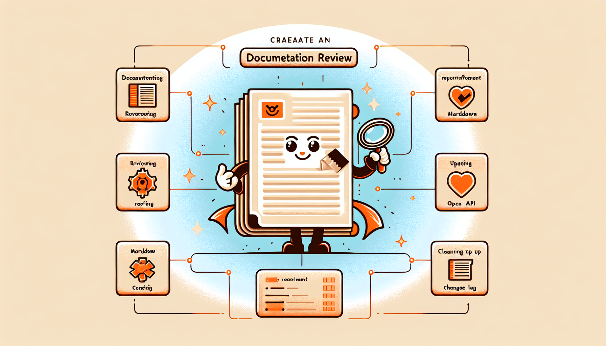

# Documentation Review Plugin

[](https://opensource.org/licenses/MIT)
[](https://github.com/anthropics/claude-code)
[](https://github.com/zircote/documentation-review/actions/workflows/ci.yml)
[](https://github.com/zircote/documentation-review/releases)

Comprehensive documentation management for Claude Code: review, create, update, and maintain high-quality documentation.

<!-- Infographic: Visual summary of plugin capabilities -->
<p align="center">
  
</p>

<details>
<summary>View infographic generation prompt</summary>

```
Create a visual infographic summarizing the Documentation Review plugin for Claude Code.

Layout: Clean, modern infographic style (1200x800px)
Background: Light cream/off-white with subtle texture

Sections:
1. HEADER: "Documentation Review" - Claude Code Plugin for Documentation Excellence
2. CORE CAPABILITIES (4 quadrants): Review, Create, Update, Cleanup
3. SUPPORTED FORMATS: Markdown, MkDocs, Sphinx, Docusaurus, OpenAPI, AsyncAPI
4. KEY COMMANDS: /doc-review → /doc-create → /doc-update → /doc-diataxis
5. FOOTER: AI-Powered • MIT License • v0.1.0

Color palette: Warm amber (#F59E0B), deep teal (#0D9488), coral (#F97316), cream (#FFFBEB)
Style: Professional, clean lines, rounded corners, subtle shadows
```

</details>

## Features

- **Documentation Review** - Analyze existing docs for accuracy, completeness, and quality
- **Documentation Creation** - Generate new docs from codebase analysis (README, API docs, templates)
- **Documentation Updates** - Keep docs current with codebase changes
- **Documentation Cleanup** - Identify obsolete or outdated content
- **Diátaxis Framework** - Classify and audit docs against Diátaxis quadrants (tutorials, how-to, reference, explanation)
- **Changelog Management** - Maintain CHANGELOG.md with Keep a Changelog format
- **Quality Validation** - Automatic checks on markdown file edits
- **Multi-format Support** - Markdown with awareness of MkDocs, Sphinx, Docusaurus
- **API Documentation** - OpenAPI/Swagger and AsyncAPI integration

## Installation

### From GitHub

```bash
claude plugin install zircote/documentation-review
```

### Manual Installation

Clone and add to Claude Code:

```bash
git clone https://github.com/zircote/documentation-review.git
claude --plugin-dir /path/to/documentation-review
```

Or copy to your project's `.claude-plugin/` directory.

## Commands

| Command | Description |
|---------|-------------|
| `/doc-review [path]` | Review documentation for issues (file, directory, or project-wide) |
| `/doc-create [type]` | Generate new documentation (readme, api, template) |
| `/doc-update [path]` | Update outdated documentation with current information |
| `/doc-cleanup` | Identify and report obsolete documentation |
| `/doc-setup` | Interactive setup for project configuration |
| `/doc-diataxis [action] [path]` | Analyze docs against Diátaxis framework (classify, review, gaps, audit) |

## Agents

| Agent | Description |
|-------|-------------|
| `doc-reviewer` | Comprehensive documentation audit with proactive triggering |
| `doc-writer` | Content generation and documentation updates |

## Skills

- **documentation-standards** - Markdown best practices, structure guidelines, writing quality
- **api-documentation** - OpenAPI/Swagger/AsyncAPI patterns and endpoint documentation
- **changelog** - Keep a Changelog format, semantic-release, conventional commits mapping
- **diataxis** - Diátaxis documentation framework quadrant classification and analysis

## Configuration

Create `.claude/documentation-review.local.md` in your project root to customize behavior.

### Quick Setup

Run `/doc-setup` for interactive configuration, or manually create the file:

```markdown
---
# Documentation paths to scan (default: auto-detect)
doc_paths:
  - docs/
  - README.md
  - "*.md"

# Files/patterns to ignore
ignore:
  - "**/node_modules/**"
  - "**/vendor/**"
  - "**/.git/**"
  - "**/dist/**"
  - "**/build/**"
  - "CHANGELOG.md"

# Documentation standards
standards:
  require_description: true
  max_heading_depth: 4
  require_code_examples: false
  check_links: true
  check_spelling: false

# API documentation settings
api_docs:
  openapi_path: null           # Auto-detect
  asyncapi_path: null          # Auto-detect
  generate_from_code: false

# Static site generator integration
site_generator:
  type: auto                   # auto, mkdocs, sphinx, docusaurus
  config_path: null            # Auto-detect

# Output preferences
output:
  verbosity: normal            # minimal, normal, detailed
  format: markdown             # markdown, json
---

# Project Documentation Notes

Add project-specific documentation context here...
```

## File Structure

```
documentation-review/
├── .claude-plugin/
│   └── plugin.json
├── agents/
│   ├── doc-reviewer.md
│   └── doc-writer.md
├── commands/
│   ├── doc-cleanup.md
│   ├── doc-create.md
│   ├── doc-diataxis.md
│   ├── doc-review.md
│   ├── doc-setup.md
│   └── doc-update.md
├── skills/
│   ├── api-documentation/
│   │   ├── SKILL.md
│   │   ├── examples/
│   │   └── references/
│   ├── changelog/
│   │   ├── SKILL.md
│   │   ├── examples/
│   │   └── references/
│   ├── diataxis/
│   │   ├── SKILL.md
│   │   ├── examples/
│   │   └── references/
│   └── documentation-standards/
│       ├── SKILL.md
│       ├── examples/
│       └── references/
├── templates/
│   └── documentation-review.local.md.example
├── CHANGELOG.md
├── LICENSE
└── README.md
```

## Usage Examples

### Review all project documentation
```bash
/doc-review
```

### Review specific file
```bash
/doc-review docs/api-reference.md
```

### Generate README from codebase
```bash
/doc-create readme
```

### Generate API documentation
```bash
/doc-create api
```

### Find outdated documentation
```bash
/doc-cleanup
```

### Classify docs against Diátaxis framework
```bash
/doc-diataxis classify docs/
```

### Audit documentation for Diátaxis coverage gaps
```bash
/doc-diataxis audit
```

## Contributing

1. Fork the repository
2. Create a feature branch
3. Make your changes
4. Submit a pull request

## License

MIT
